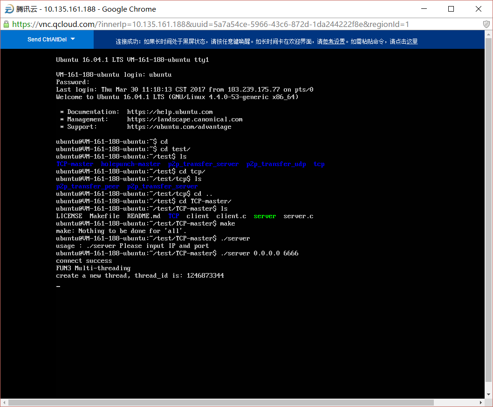
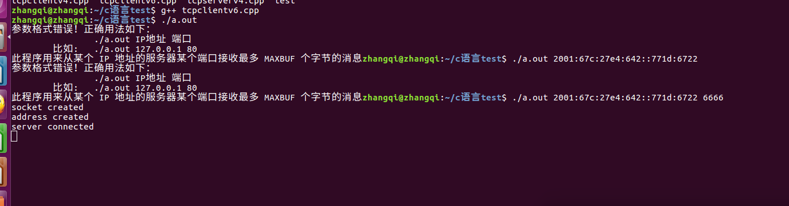

###实现苹果的getaddrinfo(DNS64/NAT64)来实现兼容ipv6
####1.合成ipv6原理：RFC:6052
#####1.1RFC6052总结：
  - 讨论了嵌入IPv4地址的IPv6地址的结构，包括IPv4-converted IPv6 address和IPv4-translatable IPv6 address的概念。指出这类地址既可以用于IPv4/IPv6的翻译，又可以用于IPv4/IPv6的隧道。

 - 定义了嵌入IPv4地址的IPv6地址的结构格式包括前缀（prefix），IPv4地址（v4），u字节（u）和后缀（suffix）。在此基础上，定义了IPv4地址到IPv6地址和IPv6地址到IPv4地址的翻译算法，给出了相应的实例。

  - 对于无状态的IPv4/IPv6翻译（IVI），内部IPv6主机的地址必须使用IPv4-translatable IPv6 address，互联网上的IPv4主机必须使用IPv4-converted IPv6 address；这两类地址的前缀必须使用运营商的路由前缀。可使用的前缀长度包含/32、/40、/48、/56、/64。无状态的IPv4/IPv6翻译可以用于的场景为“an IPv6 network to the IPv4 Internet”，“the IPv4 Internet to an IPv6 network”，“an IPv6 network to an IPv4 network”，和“an IPv4 network to an IPv6 network”。目前的IPv4和IPv6的路由配置策略均可用于无状态的IPv4/IPv6翻译，具有很好的可扩展性、安全性和可运营性.

   - 对于有状态的IPv4/IPv6翻译（NAT64），互联网上的IPv4主机必须使用IPv4-converted IPv6 address；在应用场景“the IPv6 Internet to an IPv4 network”中必须使用运营商的路由前缀，在应用场景“an IPv6 network to the IPv4 Internet”和“an IPv6 network to an IPv4 network”中，除使用运营商的路由前缀外，还可以使用well-known前缀64:ff9b::/96。

 - 讨论了RFC6052所定义的新的地址结构对于路由、网络管理和网络安全的影响。
  目前我们正在实施 “2008年下一代互联网业务试商用及设备产业化专项-教育科研基础设施IPv6技术升级和应用示范项目：IPv4/IPv6过渡系统”。该项目以RFC6052和相关系列标准为依据。国内外运营商和信息提供商也正在对基于RFC6052及其他系列标准的方案进行测试和现网部署。
#####1.2有状态的IPv4/IPv6翻译（NAT64)场景分析：（RFC6144）
   1.the IPv6 Internet to an IPv4 network
   > **ipv6-only host位于ipv6的互联网中想要去访问ipv4网络中的某个节点，这个场景只能使用特定网络前缀，不能使用64:ff9b::/96.因为路由不给转发**
   
   2.an IPv6 network to the IPv4 Internet
  > **ipv6-only host位于ipv6网络中要去访问ipv4互联网的某个节点,特定网络前缀与64:ff9b::/96都能使用**
   
   3.an IPv6 network to an IPv4 network
 > **ipv6-only host位于ipv6网络中要去访问ipv4网络中的某个节点,特定网络前缀与64:ff9b::/96都能使用**

#####1.3特定网络前缀是什么
>　原文：Network-Specific Prefix:  an IPv6 prefix assigned by an organization　for use in algorithmic mapping.
 **组织分配的前缀,实际上就是NAT64所在运营商的前缀／运营商的路由前缀，NAT64由运营商部署**
 
 #####1.4dns64/nat64来解决ipv6访问ipv4的原理是：
 -　1.ipv6这一方只能通过socketipv6发包，通过ipv6-stack封装自己的包．
 -　２．包由路由一层层转发到NAT64，NAT64将包重新封装成ipv4的包发给目的ip
 
 
####２．测试：
#####2.1测试环境:
A:client端建立一个tcp连接与Server端（119.29.103.34）
   B:client端通过ipv6-stack即socket ipv6与server端连接
   C:server端通过ipv4-stack即socket ipv４监听自己的端口
  说明：通过以上，模拟ipv6端向ipv4端建立访问

#####2.2测试原理：
 server端ip为：119.29.103.34
 我已知国外一个开放的搭建好的　NAT64 routed prefix: 2001:67c:27e4:642::/64
 根据RFC6052，[`我们建议折衷一下,可以考虑将不超过组织所分配到的 IPv6 地址的 1/256,给 IPv4/IPv6转换服务使用。例如,如果组织是 ISP,分配有 IPv6 前缀/32 或更短,该 ISP 能够给转换服务专用一个/40 前缀。分配有/48 前缀的端站点能够给转换服务专用一个/56 前缀,或者,如果所有 IPv4 可翻译 IPv6 地址位于相同链路上,可以专用一个/96 前缀。`].
 合成ipv6地址的前缀要选择/96:
 合成结果为： 2001:67c:27e4:642::771d:6722
#####2.3测试结果：
　　tcp连接建立成功．
  
  

　　
 
 