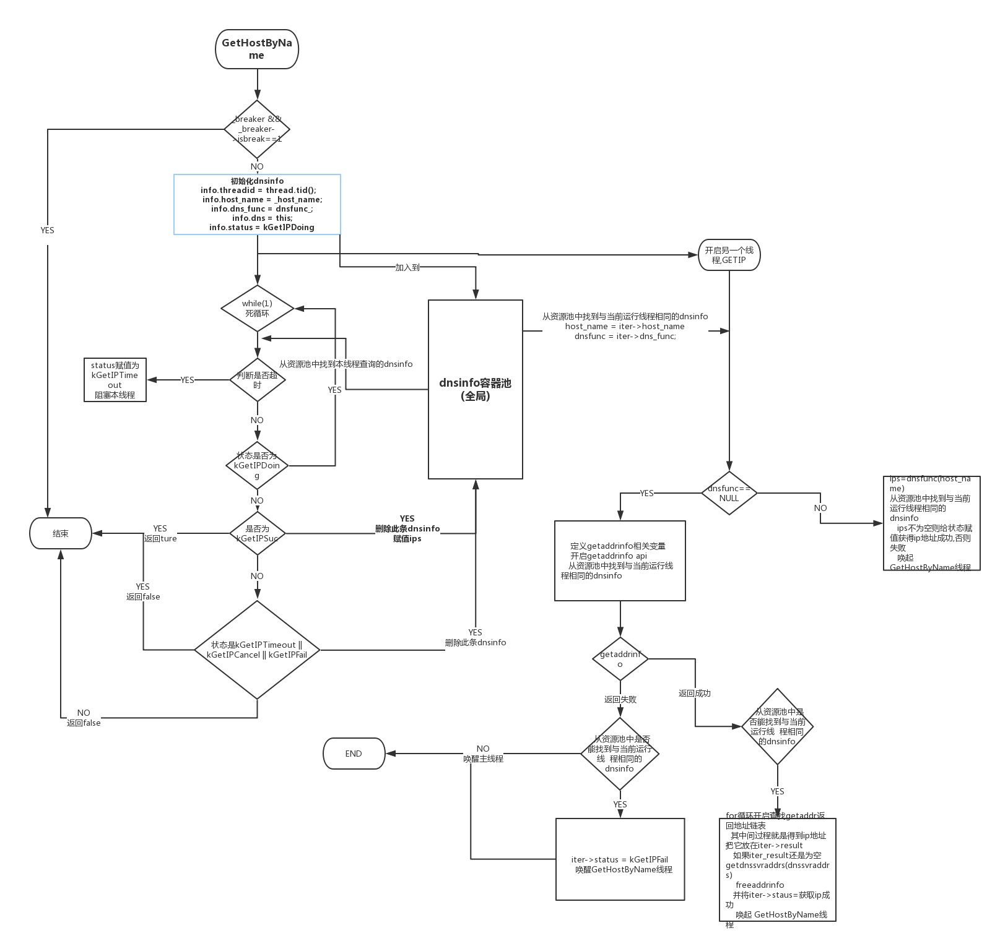

###1.结构定义与作用
**struct**
> * DNSBreaker (bool isbreak,int *dnsstatus)
      作用:
                        isbreak 
                        dnsstatus 为int型指针
> * dnsinfo(treadid,dns,dns_func,host_name,字符串容器result,status)  
       作用:用来存储dns的一些信息
                        treaddid    线程号
                        dns         DNS类
                        dns_func    函数指针:用于获取ip,这里默认NULL使用getaddrinfo去获取ip
                        host_name   dns查询域名
                        result      解析的ip地址
                        status      解析的状态

**class**
> * DNS
    在dns.cc中,定义了显示构造函数与析构函数
 ```
 DNS::DNS(DNSFunc _dnsfunc):dnsfunc_(_dnsfunc)
 作用:创建新的对象时,将函数指针_dnsfunc赋值给dnsfunc_.这里没有_dnsfunc的实体定义.
  ```
  ```
   DNS::~DNS() { Cancel();}
   作用:删除对象时或者在对象作用域后,调用cancel.这里定义的析构函数为cancel(),为空
  ```

**vector**
> *  std::vector<dnsinfo> sg_dnsinfo_vec;  作用:全局变量形成资源池,所以处理时注意加锁.


###2.DNS解析过程
```
    注:此文件中dns询问用的是getaddrinfo,但是提供一个接口(函数指针)在dns_func,可以调用其他函数.
-   建立一个dnsinfo的容器池,每个dnsinfo包含了:treaddid    线程号
                                          dns         DNS类
                                          dns_func    函数指针
                                          host_name   dns查询域名
                                          result      解析的ip地址
                                          status      解析的状态
-  GetHostByName函数
         输入:域名,超时时限
         输出:在超时时限内得到ip成功则返回解析的ip地址(存在ips容器中).
         对于几种状态的处理说明:
              超时: 当在子线程_GetIP函数中getaddrinfo时,如果超出超时时限,GetHostByName线程阻塞,_GetIP函数继续,后面会唤醒 GetHostByName线程,并退出.GetHostByName线程继续运行,将status赋值为超时.在删除节点或GetHostByName函数结束时,调用的析构函数会把资源池中status赋值为KGetIPcancel.
              未超时:GetHostByName线程在运行进入while(true)循环status为going,但未超过超时时限.如果有另一个GetHostByName线程已经返回,它会调用析构函数将我的status也赋值为KGetIPcancel,我就会退出.
-   DNS::Cancel(const std::string& _host_name)//遍历资源池,如果_host_name为空,将资源池所有的status定义为cancel ,如果不为空,找到资源池中相同的host_name将status赋值为KGetIPcancel,退出 
    DNS::Cancel(DNSBreaker& _breaker)
    用重载的方式写了cancel的两种用法
 
   
```
###3.一些不是太懂的用法

 - 在DNS类中声明Cancel(const std::string& _host_name = std::string());
  >  cancel()可以不传参数,测试代码表明为空
 - 在DNS类中声明bool GetHostByName(const std::string& _host_name, std::vector<std::string>& ips, long millsec = 2*1000, DNSBreaker* _breaker = NULL);
 > 当给 _breaker分配内存时,if (_breaker)满足执行后面的指令.一般会给_breaker->dnsstatus赋值,不懂什么意思.

- 有自己封装好的线程类
> ThreadUtil::currentthreadid()表示pthread_self()

