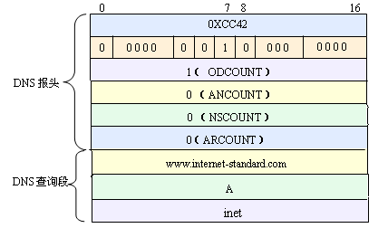

##!!!mars/sdt/src/checkimpl/dnsquery.cc相当于getaddrinfo的作用,可以与dns.cc结合

###1.结构体
**DNSquery报文结构**
       
**函数中定义的结构体**
* dns报头
```
 struct DNS_HEADER {
    unsigned    short id;           // identification number
    unsigned    char rd     : 1;    // recursion desired
    unsigned    char tc     : 1;    // truncated message
    unsigned    char aa     : 1;    // authoritive answer
    unsigned    char opcode : 4;    // purpose of message
    unsigned    char qr     : 1;    // query/response flag
    unsigned    char rcode  : 4;    // response code
    unsigned    char cd     : 1;    // checking disabled
    unsigned    char ad     : 1;    // authenticated data
    unsigned    char z      : 1;    // its z! reserved
    unsigned    char ra     : 1;    // recursion available
    unsigned    short q_count;      // number of question entries
    unsigned    short ans_count;    // number of answer entries
    unsigned    short auth_count;   // number of authority entries
    unsigned    short add_count;    // number of resource entries
};
```
*  QUESTION=DNS查询段QTYPE+QCLASS

```
struct QUESTION {
    unsigned short qtype;
    unsigned short qclass;
};

```
*  R_DATA
```
struct  R_DATA {
    unsigned short type;
    unsigned short _class;
    unsigned int   ttl;
    unsigned short data_len;
};
```
* RES_RECORD=DNS应答部分
```
struct RES_RECORD {
    unsigned char*  name;
    struct R_DATA*  resource;
    unsigned char*  rdata;
};
```
* QUERY=完整DNS查询段
```
typedef struct {
    unsigned char*       name;
    struct QUESTION*     ques;
} QUERY;
```

####2.函数

1. static void  ChangetoDnsNameFormat(unsigned char*, std::string);
  > 作用:将string型的host_name转换为qname形式
2.  static unsigned char* ReadName(unsigned char*, unsigned char*, int*);
 > 函数指针
 > 作用:读取域名,因为域名是可变长字段

3. static void GetHostDnsServerIP(std::vector<std::string>& _dns_servers);
>   输入:一个存储dns地址的容器
>   输出:获取dns服务器的ip地址将它放在输入的容器中

4. static void     PrepareDnsQueryPacket(unsigned char* _buf, struct DNS_HEADER* _dns, unsigned char* _qname, const std::string& _host);
 >   输出:按照dns协议合成dns查询报文
5. static void           ReadRecvAnswer(unsigned char* _buf, struct DNS_HEADER* _dns, unsigned char* _reader, struct RES_RECORD* _answers);
    > 输入:recv_buf缓存区地址,
    >  输入:    dns报头地址(指向recv_buf的header),
    >  输入:字符指针(向后移动到dns应答部分查询段)
    >  输入:RES_RECORD结构体来记录dns服务器的回答
      
6. static int            RecvWithinTime(int _fd, char* _buf, size_t _buf_n, struct sockaddr* _addr, socklen_t* _len, unsigned int _sec, unsigned _usec);
> 输入:socket值,缓存区地址,缓存区长度,sockaddr_in指向地址,sec,usec
>  返回值:返回-1时表示超时或错误
7. static void FreeAll(struct RES_RECORD* _answers);
>输入:结构体RES_RECORD的地址
>作用:释放这个结构体
8. static bool   isValidIpAddress(const char* _ipaddress);
> 输入:需要检查的IP地址
> 返回值:返回0表示IP地址不合法,返回1表示合法.

9. 主要函数int socket_gethostbyname(const char* _host, socket_ipinfo_t* _ipinfo, int _timeout /*ms*/, const char* _dnsserver, NetCheckTrafficMonitor* _traffic_monitor)
> 
 * 函数名:    socket_gethostbyname
 * 功能: 输入域名，可得到该域名下所对应的IP地址列表
 * 输入:       _host：输入的要查询的主机域名
 * 输入:       _timeout：设置查询超时时间，单位为毫秒,非正时默认值3秒.
 * 输入:       _dnsserver 指定的dns服务器的IP
 * 输出:        _ipinfo为要输出的ip信息结构体
 * 返回值:          当返回-1表示查询失败，当返回0则表示查询成功
 