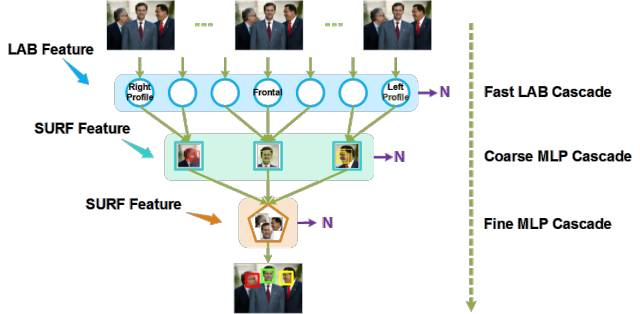

###Seetaface人脸检测模块
*  方法提出一种结合经典级联结构和多层神经网络的人脸检测方法.其所采用的漏斗型级联结构专门针对多姿态人脸检测而设计,其中引用由粗到精的设计理念


**一些概念:**
  图像金字塔:
> 对一张图像不断的模糊之后向下采样，得到不同分辨率的图像，同时每次得到的新的图像宽与高是原来图像的1/2, 最常见就是基于高斯的模糊之后采样，得到的一系列图像称为高斯金字塔。
 
 Lab特征:
   ```
   同RGB颜色空间相比，Lab是一种不常用的色彩空间。它是在1931年国际照明委员会（CIE）制定的颜色度量国际标准的基础上建立起来的。1976年，经修改后被正式命名为CIELab。它是一种设备无关的颜色系统，也是一种基于生理特征的颜色系统。这也就意味着，它是用数字化的方法来描述人的视觉感应。Lab颜色空间中的L分量用于表示像素的亮度，取值范围是[0,100],表示从纯黑到纯白；a表示从红色到绿色的范围，取值范围是[127,-128]；b表示从黄色到蓝色的范围，取值范围是[127,-128]。下图所示为Lab颜色空间的图示；
   需要提醒的是，Lab颜色空间比计算机显示器、打印机甚至比人类视觉的色域都要大，表示为 Lab 的位图比 RGB 或 CMYK 位图获得同样的精度要求更多的每像素数据。虽然我们在生活中使用RGB颜色空间更多一些，但也并非Lab颜色空间真的一无所有。例如，在 Adobe Photoshop图像处理软件中，TIFF格式文件中，PDF文档中，都可以见到Lab颜色空间的身影。而在计算机视觉中，尤其是颜色识别相关的算法设计中，rgb,hsv,lab颜色空间混用更是常用的方法。
   ```
 局部特征-SURF特征
```
 SIFT/SURF为了实现不同图像中相同场景的匹配，主要包括三个步骤：
1、尺度空间的建立；
2、特征点的提取；
3、利用特征点周围邻域的信息生成特征描述子
4、特征点匹配。
```
 ###MLP、RBF、SVM三种神经网络
 引言:

        神经网络(neural network，NN)是一个以有向图为拓扑结构的动态系统，它通过对连续或断续式的输入作状态响应而进行信息处理。是一个高度复杂的非线性动力学系统，不但具有一般非线性系统的共性，更主要的是它还具有自己的特点，比如高维性、神经元之间的广泛互连性以及自适应性或自组织性等。
        神经网络是在许多学科的基础上发展起来的，它的深入研究必然会带动其它相关学科的发展。它在数学理论本质上是非线性的数学理论，因此，现代非线性科学方面的进展必将推动神经网络的研究，同时，神经网络理论也会对非线性科学提出新课题。MLP(multilayer perceptron)、RBF(radial basis funtion)、SVM(support vector machine)三种网络是神经网络中研究的一个重点，它们具有很强的分类能力，它能解决模式分布非常复杂的分类问题，但是在结构和功能上存在一些差别。
####多层神经网路(MLP):
> 


