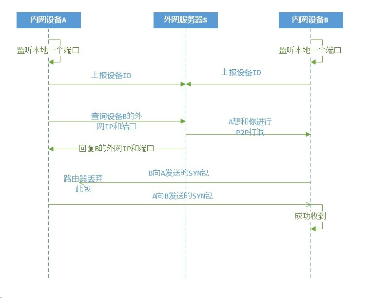
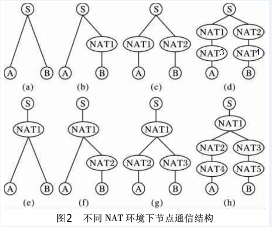
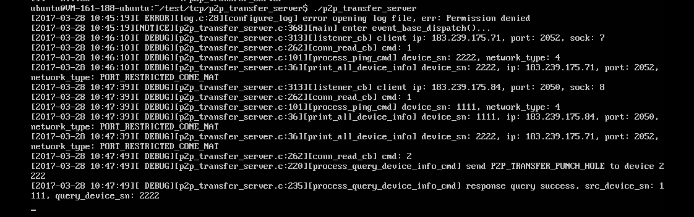

####1.原理
设备上的进程会创建3个socket，一个监听的socket，一个去connect服务器S的socket，一个去连接B的socket，关键点就在于这3个socket都需要bind一对相同的IP和端口。SO_REUSEADDR和SO_REUSEPORT解决了这个问题。
UML时序表:

####2.各种情况

####3.理论上连接的情况

####4.tcp打洞测试的结果:

####4.测试图

