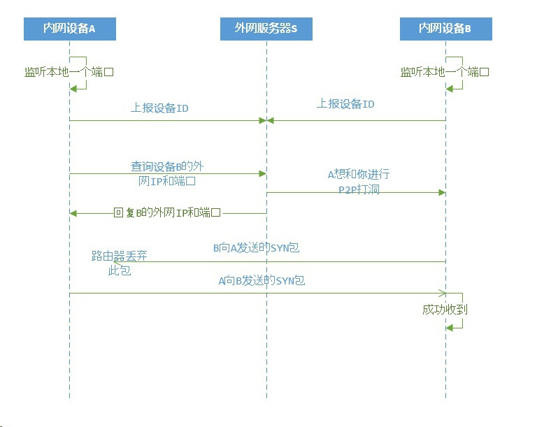
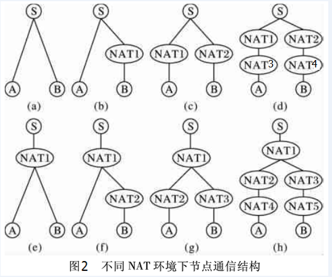
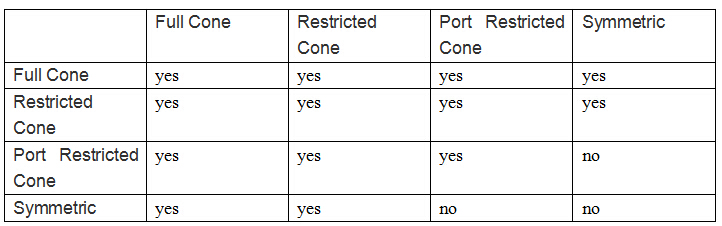
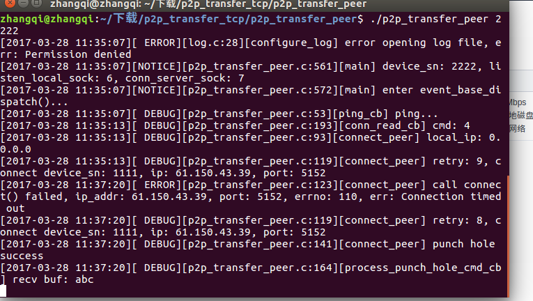
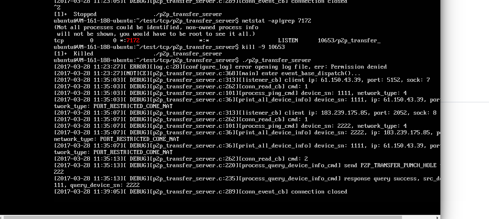
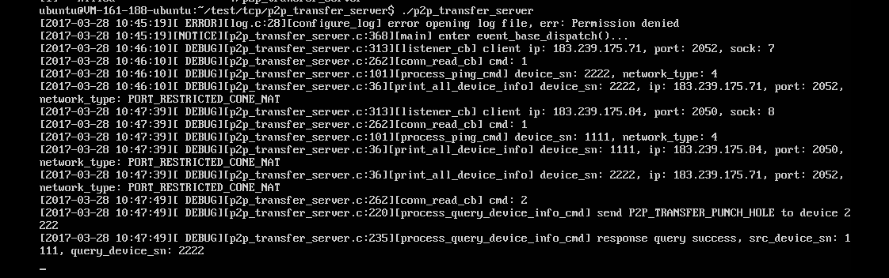

####1.原理
设备上的进程会创建3个socket，一个监听的socket，一个去connect服务器S的socket，一个去连接B的socket，关键点就在于这3个socket都需要bind一对相同的IP和端口。SO_REUSEADDR和SO_REUSEPORT解决了这个问题。
UML时序表:

####2.各种情况

####3.理论上连接的情况

####4.tcp打洞测试的结果与分析:
#####１．结果
| 情况类型 | 测试环境描述 |　测试结果　　　|
|--------|--------|-------|
|     a |       两个都位于公网中|直连就行|
|b|A为腾讯云公网ip.B为隐藏在大拿NAT后的设备.S服务器位于腾讯云.大拿nat类型为:PORT Restricted Cone|打洞成功|
|c|A位于公司的NAT后,B位于西工大NAT后.S服务器位于腾讯云 大拿nat类型为:PORT Restricted Cone西工大nat类型为:PORT Restricted Cone.|打洞成功,rtt较长|
|d|||
|e|A,B位于大拿同一NAT后,测试环境,公司同网段两台主机.S服务器位于腾讯云 .大拿nat类型为:PORT Restricted Cone|打洞失败,进行到AB直连,connect超时|
|udp的e情况|A,B位于大拿同一NAT后,测试环境,公司同网段两台主机.S服务器位于腾讯云 .大拿nat类型为:PORT Restricted Cone|收包失败|
|交换local_ip的e情况|a,b位于同一nat下|不开ap隔离，肯定打洞成功|
|交换local_ip的f,g,h情况|a,b位于同一局域网下，但a,b位于不同的nat下|理论上打洞成功，影响因素：１．ap隔离，2.local_ip是否冲突|
#####２．不能打洞成功分析:
H3C参考资料：<http://www.h3c.com.cn/MiniSite/Technology_Circle/Net_Reptile/The_Five/Home/Catalog/201206/747037_97665_0.htm> 
> 由终端A和B发往对方公网endpoint的UDP报文能否被对方收到，这取决于当前的NAT设备是否支持回环转换（hairpin translation，详见1.3节）。但是终端A与B往对端私网endpoint发送的UDP报文是一定可以到达的，无论如何，私网报文采用最短转发路径，要比经过NAT转换来的快.

####4.测试图

