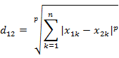
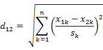
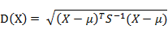
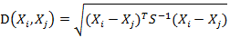
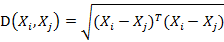
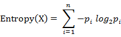

#### 图像处理的"数学之美(一)"
#####1.分类
* **各种距离**
> 在做分类时常常需要估计不同样本之间的相似性度量

  1.欧式距离
  >  源于欧式空间中两点间的距离公式
    (1)二维平面上两点a(x1,y1)与b(x2,y2)间的欧式距离
       d12^2=(x1-x2)^2+(y1-y2)^2
    (2)n维间的欧式距离
        类似
        可用向量表示:d12^2=a*a^T
        
    2.曼哈顿距离
     >  城市街道距离
      二维平面间的曼哈顿距离
        d12=|x1-x2|+|y1-y2|;
    
    3.切比雪夫距离 ( Chebyshev Distance )
    > 
     国际象棋玩过么？国王走一步能够移动到相邻的8个方格中的任意一个。那么国王从格子(x1,y1)走到格子(x2,y2)最少需要多少步？自己走走试试。你会发现最少步数总是max(| x2-x1 | , | y2-y1 | ) 步。有一种类似的一种距离度量方法叫切比雪夫距离。
       
   4.闵可夫斯基距离
    * 闵氏距离不是一种距离，而是一组距离的定义。
   > (1)闵氏距离的定义
       两个n维变量a(x11,x12,…,x1n)与b(x21,x22,…,x2n)间的闵可夫斯基距离定义为：
         
  其中p是一个变参数。
当p=1时，就是曼哈顿距离
当p=2时，就是欧氏距离
当p→∞时，就是切比雪夫距离
       根据变参数的不同，闵氏距离可以表示一类的距离。
(2)闵氏距离的缺点
　　闵氏距离，包括曼哈顿距离、欧氏距离和切比雪夫距离都存在明显的缺点。
　　举个例子：二维样本(身高,体重)，其中身高范围是150-190，体重范围是50-60，有三个样本：a(180 50)，b(190 50)，c(180 60)。那么a与b之间的闵氏距离（无论是曼哈顿距离、欧氏距离或切比雪夫距离）等于a与c之间的闵氏距离，但是身高的10cm真的等价于体重的10kg么？因此用闵氏距离来衡量这些样本间的相似度很有问题。
       简单说来，闵氏距离的缺点主要有两个：(1)将各个分量的量纲(scale)，也就是“单位”当作相同的看待了。(2)没有考虑各个分量的分布（期望，方差等)可能是不同的。       
    
    5.标准化欧氏距离(Standardized Euclidean distance )
    * 数学期望:在概率论和统计学中，数学期望(mean)（或均值，亦简称期望）是试验中每次可能结果的概率乘以其结果的总和。是最基本的数学特征之一。它反映随机变量平均取值的大小。
    * 方差:（variance)是在概率论和统计方差衡量随机变量或一组数据时离散程度的度量。概率论中方差用来度量随机变量和其数学期望（即均值）之间的偏离程度。统计中的方差（样本方差）是各个数据分别与其平均数之差的平方的和的平均数。在许多实际问题中，研究方差即偏离程度有着重要意义。
    * 标准差:是离均差平方的算术平均数的平方根，用σ表示。标准差是方差的算术平方根。标准差能反映一个数据集的离散程度。
    > (1)标准欧氏距离的定义
　　标准化欧氏距离是针对简单欧氏距离的缺点而作的一种改进方案。标准欧氏距离的思路：既然数据各维分量的分布不一样，好吧！那我先将各个分量都“标准化”到均值、方差相等吧。均值和方差标准化到多少呢？这里先复习点统计学知识吧，假设样本集X的均值(mean)为m，标准差(standarddeviation)为s，那么X的“标准化变量”表示为：
  标准化后的值 =  ( 标准化前的值  － 分量的均值 ) /分量的标准差
　　经过简单的推导就可以得到两个n维向量a(x11,x12,…,x1n)与b(x21,x22,…,x2n)间的标准化欧氏距离的公式：
   
  　如果将方差的倒数看成是一个权重，这个公式可以看成是一种加权欧氏距离(WeightedEuclidean distance)。
   
   6.马氏距离(MahalanobisDistance)
   * 协方差: 对于一般的分布，直接代入E(X)之类的就可以计算出来了，但真给你一个具体数值的分布，要计算协方差矩阵，根据这个公式来计算，还真不容易反应过来。网上值得参考的资料也不多，这里用一个例子说明协方差矩阵是怎么计算出来的吧。
记住，X、Y是一个列向量，它表示了每种情况下每个样本可能出现的数。
协方差(i,j)=（第i列的所有元素-第i列的均值）*（第j列的所有元素-第j列的均值）
     > >（1）马氏距离定义
       有M个样本向量X1~Xm，协方差矩阵记为S，均值记为向量μ，则其中样本向量X到u的马氏距离表示为：
       
         而其中向量Xi与Xj之间的马氏距离定义为：
        
       若协方差矩阵是单位矩阵（各个样本向量之间独立同分布）,则公式就成了：
       

       也就是欧氏距离了。
　　若协方差矩阵是对角矩阵，公式变成了标准化欧氏距离。
(2)马氏距离的优缺点：量纲无关，排除变量之间的相关性的干扰。
   7.夹角余弦(Cosine)
 > 几何中夹角余弦可用来衡量两个向量方向的差异，机器学习中借用这一概念来衡量样本向量之间的差异。
(1)在二维空间中向量A(x1,y1)与向量B(x2,y2)的夹角余弦公式：

   8.信息熵
>信息熵是衡量分布的混乱程度或分散程度的一种度量。分布越分散(或者说分布越平均)，信息熵就越大。分布越有序（或者说分布越集中），信息熵就越小。
       计算给定的样本集X的信息熵的公式：
       
   参数的含义：
n：样本集X的分类数
pi：X中第i类元素出现的概率
       信息熵越大表明样本集S分类越分散，信息熵越小则表明样本集X分类越集中。。当S中n个分类出现的概率一样大时（都是1/n），信息熵取最大值log2(n)。当X只有一个分类时，信息熵取最小值0

       
