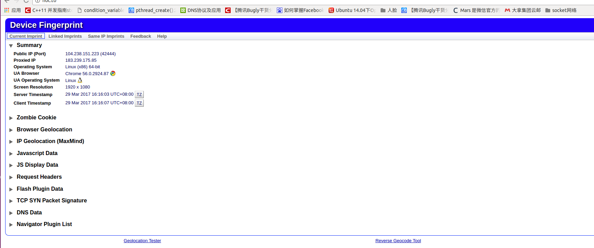
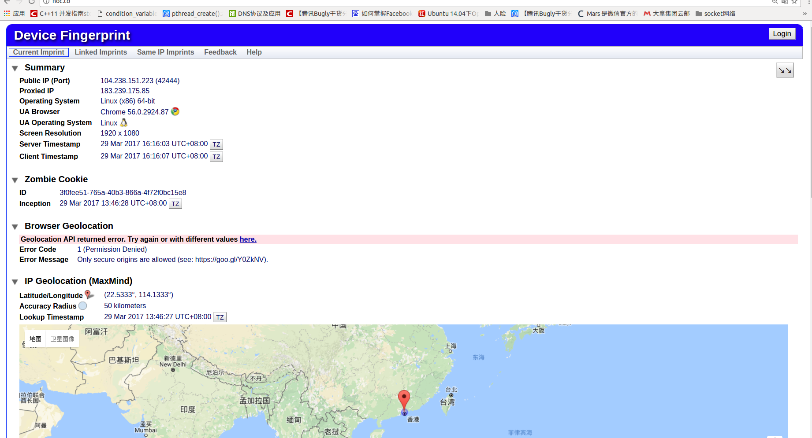
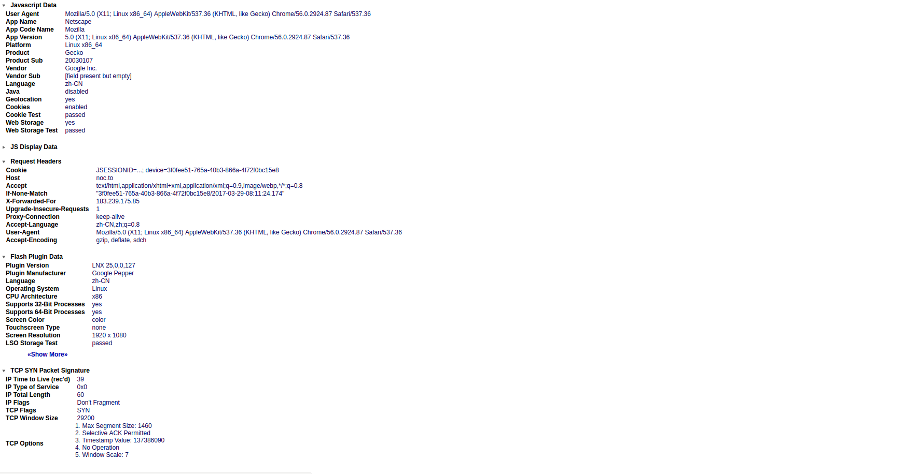
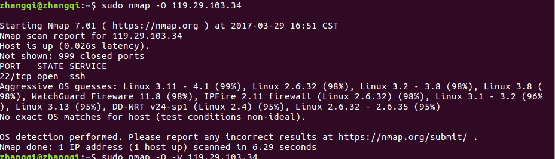

 ###Device fingerprint设备的指纹
１．定义：

　直译：一个设备指纹或者机器指纹或者浏览器指纹在使用过程被远端收集并累积信息，目的在于尽可能识别个别装置，甚至识别其使用人的真实身份,以供进一步互动或资料利用。
 
 　 比如：通过手机app等方式获取的用户的移动终端设备（手机、平板电脑、lap top等）的特征码，包括设备型号、屏幕尺寸、网络能力等等，这就相当于设备的“指纹”。有助于商家了解客户并投放适合设备的内容和广告．

２．性质
 - **Diversity多样性**：要求两台不同的机器有不同的指纹．但是有很多由于ｏｓ相同，配置文件相同导致他们的指纹相同．**一种补救方法是通过脚本语言收集更多来着客户端的参数信息，但是会减小指纹的稳定性**．
 - **Stability稳定性**：要求指纹不要随时间变化

３．主动与被动收集
- **被动收集**：不需要明显的去访问客户端的设备．通过客户端tcp/ip的配置，os的不同，无线设置等因素去分类．
- **主动收集**：允许客户端容忍一些入侵访问．最主动方法直接在客户端跑一个可执行程序去获取信息．比如MAC地址等等.

4.OSI model fingerprints
 一些被动收集是发生在OSI层中的：
如：
OSI Layer 7: SMB, FTP, HTTP, Telnet, TLS/SSL, DHCP[9]
OSI Layer 5: SNMP, NetBIOS
OSI Layer 4: TCP (see TCP/IP stack fingerprinting)
OSI Layer 3: IPv4, IPv6, ICMP, IEEE 802.11[7]
OSI Layer 2: CDP[10]

###设备指纹的应用
Device Fingerprint网站:<http://noc.to/>
 **访问这个网站因为建立连接，可以获取客户端很多信息**
 
 
 
 ###TCP/IP stack fingerprinting网络协议栈指纹
　上边介绍了设备的指纹，协议栈的指纹就属于设备指纹的一类．对TCP协议族来说，这些差异通常表现在数据包头的标志字段中。如window size、ACK序号、TTL等的不同取值。通过对这些差别进行归纳和总结，可以比较准确地识别出远程系统的OS类型。

 #####１．网络协议栈指纹构成
  下面列出了不同OS的网络协议栈的差异，这些差异可作为协议栈指纹识别的依据。
  1.TTL
TTL：Time To Live，即数据包的“存活时间”，表示一个数据包在被丢弃之前可以通过多少跃点(Hop)。不同操作系统的缺省TTL值往往是不同的。

 常见操作系统的TTL值：
> Windows 9x/NT/2000 Intel      128 
Digital Unix 4.0 Alpha            60 
Linux 2.2.x Intel                  64 
Netware 4.11 Intel                  128 
AIX 4.3.x IBM/RS6000      60 
Cisco 12.0 2514                  255 
Solaris 8 Intel/Sparc            64 
…etc

2.DF位
 >  DF（不分段）位识别：不同OS对DF位有不同的处理方式，有些OS设置DF位，有些不设置DF位；还有一些OS在特定场合设置DF位，在其它场合不设置DF位。

3.Window Size
  > Window Size：TCP接收（发送）窗口大小。它决定了接收信息的机器在收到多少数据包后发送ACK包。
    特定操作系统的缺省Window Size基本是常数，例如，AIX 用0x3F25，Windows、OpenBSD 、FreeBSD用0x402E。
    一般地，UNIX的Window Size较大。MSWindows，路由器，交换机等的较小。
 
4.ACK 序号
 > 不同的OS处理ACK序号时是不同的。如果发送一个FIN|PSH|URG的数据包到一个关闭的TCP 端口，大多数OS会把回应ACK包的序号设置为发送的包的初始序号，而Windows 和一些打印机则会发送序号为初始序号加1的ACK包。

5.ICMP地址屏蔽请求
6.对FIN包的响应
7.虚假标记的SYN包
8.ISN (初始化序列号)
9.ICMP 错误信息
10.ICMP 消息引用
 ....
 ####2.网络协议栈指纹获取远端主机信息测试
 **对于没有建立连接的设备，我只知道它的ip地址或者域名**
 #####１．测试工具：nmap
 
 #####２．测试原理：
 ```
 Nmap的操作系统检测的基础是有开放和关闭的端口Nmap.并且它有一个名为的nmap-OS-DB数据库，该数据库包含超过2600操作系统的信息。 Nmap把TCP和UDP数据包发送到目标机器上，然后检查结果和数据库对照。
  ```
  #####3.测试命令：
  ＜命令行执行＞$sudo nmap -O 119.29.103.34
     -O ：查询OS版本
     119.29.103.34：租的腾讯云服务器
  #####4.测试结果：
  　　
  
